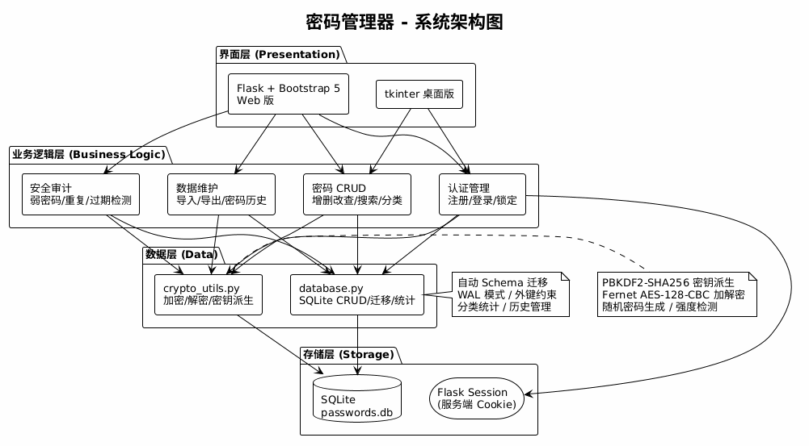

# 🔐 密码管理器 (Password Manager)

基于 Python 开发的本地加密密码管理工具，支持桌面版 (tkinter) 和 Web 版 (Flask + Bootstrap 5)。

> **Python 大二期末课程设计项目** | 武汉商学院 - Python程序设计

## ✨ 功能特性

### 🔒 安全加密
- **AES-128-CBC + HMAC-SHA256** 认证加密 (Fernet)
- **PBKDF2-SHA256** 密钥派生 (480,000 次迭代 + 随机盐值)
- 全数据本地存储，零云端依赖
- 修改主密码自动重加密所有条目

### 📋 密码管理
- 增删改查 + 实时搜索 (250ms 防抖)
- 8 种分类标签 (社交/邮箱/金融/购物/工作/学习/娱乐/其他)
- 一键生成 16 位强密码 + 强度实时评估
- 安全剪贴板 (30 秒自动清除)
- 密码变更历史记录

### 🔍 安全审计
- 弱密码检测 (强度 <= 2/5)
- 重复密码检测 (跨站复用警告)
- 过期密码检测 (>90 天未更新)
- 安全评分 (0-100)

### 📥 导入导出
- CSV 明文导出 (兼容 Excel)
- JSON 加密备份 (密码保持密文)
- CSV 批量导入

### 🔒 会话安全
- 10 分钟无操作自动锁定
- 1 分钟倒计时警告
- 错误密码次数限制

## 📁 项目结构

```
password-manager/
├── README.md
├── .gitignore
├── shared/                  # 共享模块
│   ├── crypto_utils.py      # 加密/解密/密钥派生/密码生成
│   └── database.py          # SQLite CRUD / 迁移 / 统计
├── desktop/                 # 桌面版 (tkinter)
│   ├── main.py              # GUI 主程序
│   └── requirements.txt
├── web/                     # Web 版 (Flask)
│   ├── app.py               # Flask 后端 (20+ 路由)
│   ├── requirements.txt
│   ├── templates/           # Jinja2 模板 (6 个页面)
│   │   ├── base.html        # 基础布局 + 自动锁定倒计时
│   │   ├── login.html       # 登录页
│   │   ├── register.html    # 注册页
│   │   ├── index.html       # 仪表盘 (分类筛选 + 密码年龄)
│   │   ├── entry.html       # 添加/编辑表单
│   │   ├── audit.html       # 安全审计面板
│   │   ├── export.html      # 导入导出页面
│   │   └── change_password.html  # 修改主密码
│   └── static/
│       └── style.css
└── docs/                    # 文档与图表
    ├── architecture.puml    # 系统架构图 (PlantUML)
    ├── architecture.png
    ├── flow_login.puml      # 登录流程图
    ├── flow_login.png
    ├── flow_crud.puml       # CRUD 流程图
    └── flow_crud.png
```

## 🚀 快速开始

### 环境要求
- Python 3.10+
- pip

### 安装运行 - Web 版 (推荐)

```bash
cd web
pip install -r requirements.txt
python app.py
```

浏览器访问: **http://localhost:5000**

### 安装运行 - 桌面版

```bash
cd desktop
pip install -r requirements.txt
python main.py
```

### 首次使用

1. 打开后自动跳转到**注册页面**
2. 设置一个**主密码** (至少 6 位)
3. 进入仪表盘，开始添加密码！

> ⚠️ **主密码是解密所有数据的唯一凭证，遗忘后无法找回！**

## 🛠 技术栈

| 层级 | 技术 | 说明 |
|------|------|------|
| 加密 | cryptography (Fernet + PBKDF2) | AES-128 认证加密 |
| 数据库 | SQLite3 (WAL 模式) | 本地轻量存储 |
| 桌面 GUI | tkinter | Python 标准库 |
| Web 后端 | Flask 3.x | 轻量 Web 框架 |
| Web 前端 | Bootstrap 5 + Jinja2 | 响应式 UI |
| 图表 | PlantUML (Kroki) | 架构/流程图 |

## 📊 系统架构

```
┌─────────────────────────────────┐
│      界面层 (Presentation)       │
│   tkinter GUI / Flask+Bootstrap  │
├─────────────────────────────────┤
│      业务逻辑层 (Logic)          │
│   认证 │ CRUD │ 审计 │ 导入导出  │
├─────────────────────────────────┤
│      数据层 (Data)               │
│   crypto_utils │ database        │
├─────────────────────────────────┤
│      存储层 (Storage)            │
│      SQLite (.db) │ Session     │
└─────────────────────────────────┘
```



## 🔑 加密方案

```
用户主密码
    ↓ PBKDF2-SHA256 (480,000 次迭代 + 16 字节随机盐)
32 字节密钥 → URL-safe Base64 编码
    ↓ Fernet (AES-128-CBC + HMAC-SHA256)
密文 (Base64 字符串) → 存入 SQLite
```

## 📝 课程设计报告

- 📄 [课程设计报告 (Word)](../密码管理器_课程设计报告.docx)
- 📊 [立项汇报 PPT](../密码管理器_项目立项汇报_v2.pptx)

## ⚠️ 安全声明

本项目是**课程设计作品**，用于学习 Python 编程和加密技术。虽然采用了工业级加密标准，但在以下方面存在简化：

- Flask Session 使用签名 Cookie 存储主密码，生产环境应使用服务端 Session
- Web 版未启用 HTTPS (localhost 场景风险可接受)
- 密码强度检测仅基于规则评分，未使用字典攻击检测

## 📄 许可证

MIT License - 仅供学习交流使用

---

**作者**: 武汉商学院 软件工程系  
**日期**: 2026年6月
